### About

Hi there, I am Mauro, astrophysicist and data scientist by training with a passion for coding and everything AI-related. I love to explore new ways to visualize complex data sets and research results. In my free time you will probably find me outdoors, training handstands or reading a good book. Feel free to reach out, whether it's serious business or just for a friendly hi!
Find out more through my [portfolio](https://maurbe.github.io/).
<!--
My academic CV can be found [here (December 2025)](https://maurbe.github.io/static/CV_academic-79759c9a72db90709904446cb40e4492.pdf).
-->

<!--

-->

<!--
**maurbe/maurbe** is a ✨ _special_ ✨ repository because its `README.md` (this file) appears on your GitHub profile.

Here are some ideas to get you started:

- 🔭 I’m currently working on ...
- 🌱 I’m currently learning ...
- 👯 I’m looking to collaborate on ...
- 🤔 I’m looking for help with ...
- 💬 Ask me about ...
- 📫 How to reach me: ...
- 😄 Pronouns: ...
- ⚡ Fun fact: ...
-->
